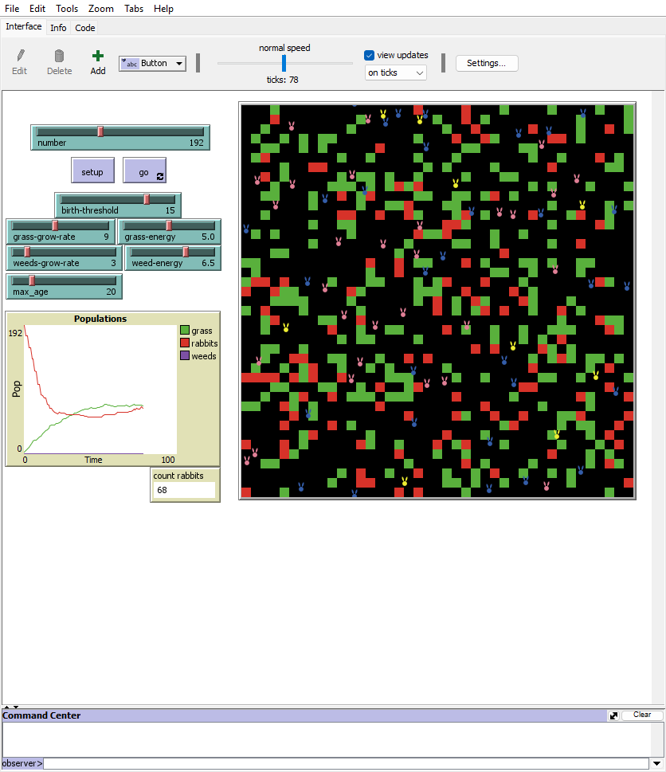
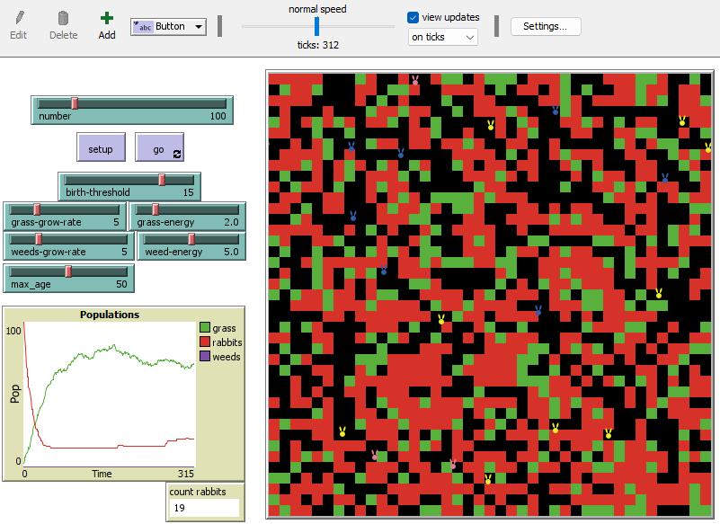
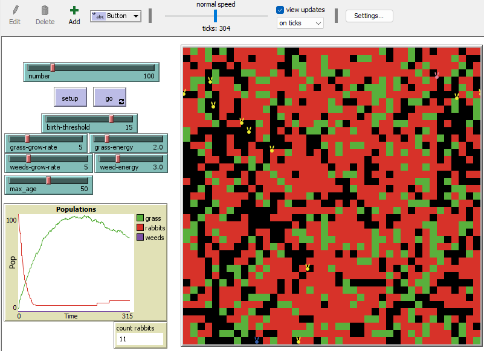
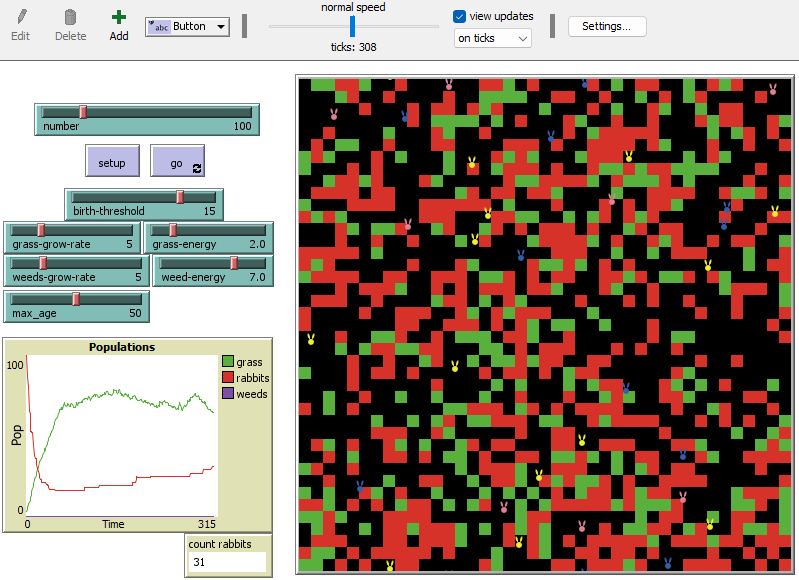
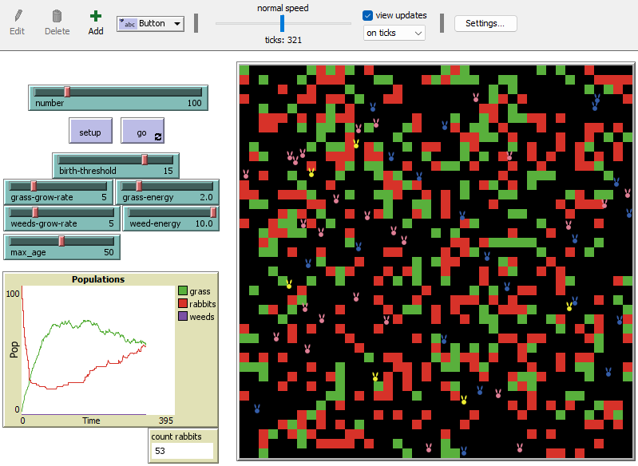

## Комп'ютерні системи імітаційного моделювання
## СПм-22-5, **Галицька Олександра Олегівна**
### Лабораторна робота №**2**. Редагування імітаційних моделей у середовищі NetLogo

### Варіант 6, модель у середовищі NetLogo:
[Rabbits Grass Weeds](http://www.netlogoweb.org/launch#http://www.netlogoweb.org/assets/modelslib/Sample%20Models/Biology/Rabbits%20Grass%20Weeds.nlogo)

Додати можливість отруїтися при поїданні бур'янів (зазначена у внутрішніх параметрах, як певна вірогідність). Захворілий кролик не може харчуватися, переміщатися і розмножуватися, позначається іншим кольором і залишається хворим на 3 такти модельного часу. Додати поділ кроликів на самців та самок. Поява нових кроликів має вимагати не тільки ситості, а й здоров'я, та присутності в одній із сусідніх клітин іншого ситого здорового кролика протилежної статі. Поява потомства відбувається із ймовірністю 50%.

 

Для початку було додано нові "властивості" агентам(кроликам):
<pre>
rabbits-own [ energy health male? age ]
</pre>

Та ініціалізовано у **setup**. Після цього почала з найлегшого, прописавши *присвоєння гендеру та відповідного коліру агентам*:
<pre>
set age 0
set health 3
set male? one-of [ true false ]
 ifelse male?
  [ set color blue ]
  [ set color pink ]
</pre>

Одразу з внеснеих змін на власний розуд:
Змінила колір бур'яна на червоний:
<pre>
to grow-grass-and-weeds
  ask patches [
    if pcolor = black or pcolor = green [
      if random-float 1000 < grass-grow-rate
        [ set pcolor green ]
      if random-float 1000 < weeds-grow-rate
        [ set pcolor red ]
    ]
  ]
end
</pre>

Наступна зміна по варіанту - *Додати можливість отруїтися при поїданні бур'янів*:
Додала зміни у відповідну процедуру **eat-weeds**:
<pre>
  to eat-weeds
  if pcolor = red
  [
    ifelse random 3 = 1
    [
      set color yellow
      set health 0
      set pcolor black
    ]
    [
      set pcolor black
      set energy energy + weed-energy
    ]
  ]
end
</pre>

Та зміни, що додають вплив на кролика *Захворілий кролик не може харчуватися, переміщатися і розмножуватися, позначається іншим кольором і залишається хворим на 3 такти модельного часу...*:

<pre>
to move  ;; rabbit procedure
  set age age + 1
  ifelse health = 3
  [
    if color = yellow
    [
      ifelse male?
        [ set color blue ]
        [ set color pink ]
    ]
    rt random 50
    lt random 50
    fd 1
    set energy energy - 0.5
  ]
  [
    set health health + 1
  ]
end
</pre>

Наступною великою зміною була зміна логіки розмноження. *Поява нових кроликів має вимагати не тільки ситості, а й здоров'я, та присутності в одній із сусідніх клітин іншого ситого здорового кролика протилежної статі. Поява потомства відбувається із ймовірністю 50%.* Були внесені великі зміни у процедуру **reproduce**:

<pre>
to reproduce     ;; rabbit procedure
  if energy > birth-threshold and health = 3
  [
    if male? = true and any? rabbits in-radius 1 with [male? = false and health = 3 and energy > birth-threshold]
    [
      ;; male rabbits only lose energy
      set energy energy / 2
    ]
    if male? = false and any? rabbits in-radius 1 with [male? = true and health = 3 and energy > birth-threshold]
    [
      ;; female rabbits lose energy and give birth
      set energy energy / 2
      if one-of [ true false ] = true
      [
        hatch one-of [1 2] [
          set age 0
          set health 3
          set male? one-of [ true false ]
          ifelse male?
            [ set color blue ]
            [ set color pink ]
          setxy random-xcor random-ycor
          set energy random 10
          fd 1
        ]
      ]
    ]
  ]
end
</pre>

## Зміни на власний розсуд:
### Змінено колір бур'яна

Як вже було вказано вище - трохи змінена процедура **grow-grass-and-weeds**.

###Смерть від старості

Було додано можливість померти від старості та важіль для встановлення максимального віку:
<pre>
to death     ;; rabbit procedure
  ;; die if you run out of energy
  if energy < 0 or age > max_age * 10 [ die ]
end
</pre>

У результаті внесенних змін під час роботи симуляція виглядає так:

## Експерименти
### Дослідження впливу енергії від бур'яну
У процесі внесення змін у модель бур'ян почав бути отруйним. Але якщо прийняти таку умову, що бур'ян дає більше енергії ніж трава - отруїтися їм може бути іноді навіть корисно. Саме така ситуація буде досліджуватися у ході експерименту:

Керуючі параметри:
- **number** - 100
- **birth-threshold** - 15
- **grass-growth-rate** - 5
- **weeds-growth-rate** - 5
- **grass-energy** - 2
- **max_age** - 50

<table>
<thead>
<tr><th>Енергія від бур'яну</th><th>Кількість кроликів</th></tr>
</thead>
<tbody>
<tr><td>3</td><td>12</td></tr>
<tr><td>5</td><td>19</td></tr>
<tr><td>7</td><td>31</td></tr>
<tr><td>10</td><td>53</td></tr>
</tbody>
</table>

Відповідні скриншоти:

Підексперимент 1:

Підексперимент 2:

Підексперимент 3:

Підексперимент 4:

Як можна помітити з результатів експерименту - у випадку, якщо трава дає 2 одиниці енергії, а бур'ян - 3, то більшість кроликів при поїданні бур'яна та отруєння через те, що стояли на місці(за умов отруєння) та не мали змогу отримати достатню кількість енергії помирали так і не встигши надати потоммство. Але по мірі збільшення кількості енергії, що отримується під час поїдання бур'яну фактор отруєння все менше і менше впливав на збільшення кількості кроликів.
